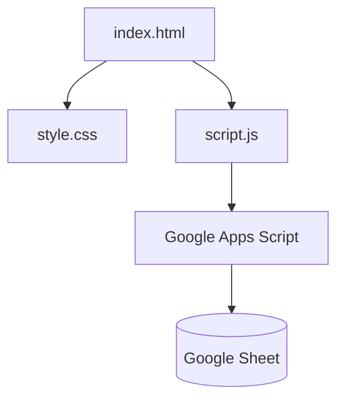

# ✨ Modern Waitlist Landing Page

A premium, dark-themed waitlist page featuring advanced glassmorphism effects, smooth animations, and a serverless backend using Google Sheets.

## 🚀 Features

*   **Glassmorphism UI**: High-quality frosted glass effects with border highlighting.
*   **Dynamic Animations**:
    *   🌀 **Moving Gradient Border**: A glowing aura that rotates around the card.
    *   🌌 **Floating Background**: Subtle movement for depth.
    *   💡 **Typing Light**: Input fields glow when focused.
    *   ✨ **Success Morph**: The card shrinks and glows green upon submission.
*   **Fully Responsive**: Optimizes layout for mobile, tablet, and desktop.
*   **No Backend Server**: Uses **Google Sheets** as a database (free and reliable).

---

## 🛠️ Setup Guide

### 1. Local Setup
Simply open `index.html` in your browser. No build process required!

```bash
# Clone the repository
git clone https://your-repo-url.git

# Open the project
cd waitlist-page
start index.html
```

### 2. Backend Integration (Google Sheets)
This project uses Google Apps Script to save emails directly to a Spreadsheet.

1.  Go to **[Google Sheets](https://sheets.google.com)** and create a NEW Sheet.
2.  Click **Extensions** > **Apps Script**.
3.  Paste the code from `google_apps_script.js` into the editor.
4.  **Save** and click **Deploy** > **New deployment**.
    *   **Type**: Web App
    *   **Who has access**: Anyone (Important!)
5.  Copy the **Web App URL**.
6.  Open `script.js` and paste your URL:

```javascript
// script.js
const SCRIPT_URL = 'https://script.google.com/macros/s/YOUR_DEPLOYMENT_ID/exec';
```

---

## 🎨 Design & Code Highlights

### 🔥 The Glowing Border Effect
We use a `conic-gradient` mask to create the rotating border effect without affecting the inner content.

```css
/* style.css */
.glass-card::before {
    content: '';
    position: absolute;
    inset: -2px;
    background: conic-gradient(
        from 0deg, 
        transparent 0deg, 
        rgba(255, 165, 0, 0.5) 120deg, 
        rgba(255, 255, 255, 0.8) 160deg, 
        transparent 240deg
    );
    animation: borderRotate 4s linear infinite;
    z-index: -1;
}

@keyframes borderRotate {
    from { --angle: 0deg; transform: rotate(0deg); }
    to { --angle: 360deg; transform: rotate(360deg); }
}
```

### ☁️ Glassmorphism
The glass effect is achieved using `backdrop-filter` and layered gradients.

```css
.glass-card {
    background: linear-gradient(135deg, rgba(255, 255, 255, 0.05), rgba(255, 255, 255, 0.01));
    backdrop-filter: blur(20px);
    border: 1px solid rgba(255, 255, 255, 0.08);
    box-shadow: 0 20px 50px rgba(0, 0, 0, 0.5);
}
```

---

## 📂 Project Structure



- **index.html**: Main structure.
- **style.css**: All styling and animations.
- **script.js**: Handles form submission and UI transitions.
- **google_apps_script.js**: Backend code for Google Sheets.

---

## 📝 Customization

- **Change Background**: Replace `background.jpg` with your own image.
- **Colors**: Edit the gradient values in `.glass-card::before` in `style.css` to change the glow color.
- **Icons**: We use FontAwesome for icons. You can change them in the `<i class="...">` tags.
